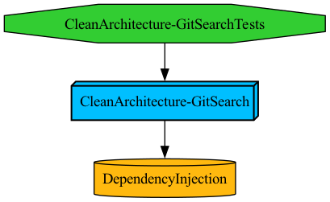

# CleanArchitecture-Example

> Tuist를 사용한 모듈식 설계와 클린 아키텍처를 준수한 iOS 샘플 애플리케이션입니다. 

### 주요 기능
- Github 인증을 통한 로그인 기능
- Github 사용자 검색 및 상세 결과 표시
- 개인 정보 및 로그아웃 기능
   
### 개발 환경 
- Tuist 4.43.1 활용하여 모듈화 적용 
- Swift 5.x, iOS 16.0, XCode 14.0
--- 
## 모듈 구조 설명 

### 핵심 모듈 레이어
- **APP**
   - 다른 모든 모듈을 통합하고 앱 최초 진입점을 제공하는 핵심 모듈입니다. 
   - 의존성: Data, Presentation, Shared
   - 책임
      1. 애플리케이션 생명주기 관리 
      2. 초기 네비게이션 설정
      3. 초기 의존성 등록 
- **Shared**

- **DependencyInjection**

### 클린 아키텍처 레이어
- **Presentation**
- **Domain**
- **Data**
- **Core**

--- 
## 아키텍처 설명 

--- 
## 주요 기능 설명 

